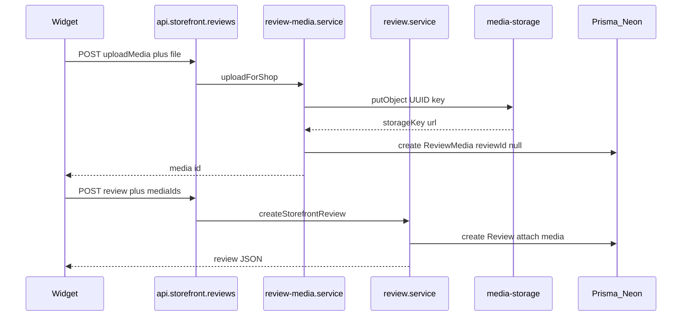

# ReviewX — S3 Media Architecture

Version: 2.0  
Status: Source of truth  
Replaces: v1.0 draft (Remix / Multer / parallel submit API)

## Stack

- Shopify embedded app (React Router 7 + `@shopify/shopify-app-react-router`)
- Theme App Extension (storefront review widget)
- Prisma → PostgreSQL (hosted on Neon)
- S3-compatible object storage via `MediaStorage`
  - **Target production:** AWS S3
  - Compatible: Cloudflare R2 or any SigV4 S3 API
  - Local fallback: disk under `storage/media` when `MEDIA_*` is unset

This document defines how review photos and videos are stored. Follow it for
media work. Prefer extending existing modules over parallel implementations.

---

## Goal

Customers attach images and videos to product reviews.

- **Object bytes** live in S3 (or local disk in development).
- **Neon / Postgres** stores only references and metadata (`storageKey`, `url`,
  mime, size, kind) — never file binaries or Base64.

```text
Browser (Theme widget)
  → Backend (React Router, app proxy)
  → Parse multipart via request.formData()   // NOT Multer
  → Validate in review-media feature service
  → MediaStorage PutObject → AWS S3 (or S3-compatible)
  → Prisma writes ReviewMedia → Neon Postgres
  → JSON response
```

The frontend never talks to S3 and never sees AWS credentials.

---

## Canonical upload flow (current production)

Production uses a **two-step** storefront flow. Both steps use the same app
proxy endpoint. The logical stack is still backend → S3 → Neon.

```text
Customer
  → Review Widget
  → POST /apps/reviews  (Shopify app proxy)
  → app/routes/api.storefront.reviews.tsx

Step A — upload each file
  intent=uploadMedia + file
  → reviewMediaService.uploadForShop
  → mediaStorage.putObject
  → reviewMediaRepository.create (reviewId = null)
  → { media: { id, url, kind, ... } }

Step B — submit review
  rating, body, author… + mediaIds
  → reviewService.createStorefrontReview
  → resolveForAttach / attachToReview
  → Prisma Review + attach ReviewMedia
  → hasImage / hasVideo flags
  → JSON review
```



### Optional future: one-shot multipart submit

A single POST that carries review fields and files together is compatible with
this architecture but is **not required** to use AWS S3. Do not add a parallel
public route (for example `api.review.submit`) unless the app proxy and widget
are deliberately migrated. Prefer extending
`api.storefront.reviews.tsx` and the existing services.

---

## Layer responsibilities

| Layer | Responsibility | Must not |
| --- | --- | --- |
| Route (`api.storefront.reviews.tsx`) | App-proxy auth, `request.formData()`, call services, map errors to JSON | S3 I/O, Prisma, MIME/size business rules |
| Feature services (`review-media.service`, `review.service`) | Validation, key naming, upload orchestration, attach rules, tenant checks | Raw AWS signing, HTTP transport details |
| MediaStorage (`media-storage.server.ts`) | PutObject and DeleteObject (S3 + local), local read for dev | Prisma, Remix/React Router request objects, product rules |
| Repository (`review-media.repository`, `review.repository`) | Prisma only | Uploads, AWS |
| Theme widget | Collect files, preview, POST, show errors | AWS credentials, bucket names, direct S3 |

Thin loaders/actions (React Router) stay the convention: routes coordinate;
services own workflows.

---

## File map (reuse — do not duplicate)

| Concept (older drafts) | Live path |
| --- | --- |
| `api.review.submit.ts` | `app/routes/api.storefront.reviews.tsx` |
| `s3.server.ts` / `aws.server.ts` | `app/services/media-storage.server.ts` |
| `review.server.ts` (media pieces) | `app/features/reviews/review-media.service.server.ts` + `review.service.server.ts` |
| Prisma “models” layer | `app/repositories/review-media.repository.server.ts` (+ `review.repository`) |
| Local media GET | `app/routes/api.media.$.tsx` |
| Widget upload client | `extensions/review-widget/assets/review-widget.js` |

Do **not** introduce Multer, a second submit API, or a second S3 client module
unless an approved redesign replaces this map.

---

## Object keys and “folders”

S3 has no real folders. Prefixes are part of the object key.

**Current key layout** (`ReviewMedia.kind` selects the media-type prefix;
`shopId` keeps tenant isolation):

```text
review-images/{shopId}/{uuid}.{ext}   # IMAGE
review-videos/{shopId}/{uuid}.{ext}   # VIDEO
```

- Always generate a **UUID** filename; never trust the original client name as
  the object key.
- Do not pre-create empty prefix objects in the bucket; keys appear on first
  `PutObject`.
- Older objects may still use `shops/{shopId}/reviews/{uuid}.{ext}`. Those
  rows remain valid via stored `storageKey`; only **new** uploads use the
  layout above.
- Console prefixes such as `exports/`, `imports/`, or `merchant-logos/` are
  unused by review media unless a later approved feature writes there.

Examples:

```text
review-images/clxyz…/d94f5af8-….jpg
review-videos/clxyz…/a1b2c3d4-….mp4
```

---

## AWS S3 integration

### Runtime (application)

When all required `MEDIA_*` variables are set, `createMediaStorage()` uses the
S3-compatible PutObject implementation (SigV4). The same adapter works for
**AWS S3** and Cloudflare R2.

When they are unset, development uses `LocalDiskMediaStorage` and public paths
under `/api/media/...`.

All AWS/S3 network I/O stays inside `app/services/media-storage.server.ts`.

### Environment variables

```env
MEDIA_S3_BUCKET=
MEDIA_S3_ENDPOINT=
MEDIA_S3_ACCESS_KEY_ID=
MEDIA_S3_SECRET_ACCESS_KEY=
MEDIA_PUBLIC_BASE_URL=
MEDIA_S3_REGION=
```

| Variable | Notes |
| --- | --- |
| `MEDIA_S3_BUCKET` | Bucket name |
| `MEDIA_S3_ENDPOINT` | AWS example: `https://s3.ap-south-1.amazonaws.com` (use your region) |
| `MEDIA_S3_REGION` | Real AWS region (e.g. `ap-south-1`). R2 often used `auto`; AWS needs a concrete region |
| `MEDIA_S3_ACCESS_KEY_ID` / `MEDIA_S3_SECRET_ACCESS_KEY` | IAM credentials with least privilege |
| `MEDIA_PUBLIC_BASE_URL` | Public base for object URLs (bucket URL or CloudFront), no trailing slash |

Never commit real secrets. Never expose these to the Theme Extension or browser.
Store production values in the host’s secret manager.

Stored public URL shape (built at read time from `storageKey`):

```text
{MEDIA_PUBLIC_BASE_URL}/{storageKey}
```

The `ReviewMedia.url` column may still be written on upload for schema
compatibility, but API/admin responses must use
`buildPublicMediaUrl(storageKey)` so changing CloudFront or the bucket domain
does not require rewriting Neon rows.

### Operator setup (outside the app)

1. Create an S3 bucket in your AWS account.
2. Create an IAM user or role with least privilege on
   `review-images/*` and `review-videos/*` (and optionally legacy `shops/*`
   for older objects): `s3:PutObject`, `s3:DeleteObject`; `s3:GetObject` if
   the app or CDN needs it.
3. Configure public read or CloudFront so storefront/admin can load media URLs.
4. Set `MEDIA_*` in local `.env` or hosting secrets.
5. Do not paste access keys into chat or git.

Switching from R2 to AWS S3 is primarily **configuration**. Existing
`ReviewMedia` rows keep their previous URLs/keys until objects are migrated or
re-uploaded.

---

## Database (Neon Postgres via Prisma)

Neon is the managed Postgres host. Prisma is the access layer.

### `ReviewMedia`

| Field | Purpose |
| --- | --- |
| `shopId` | Tenant boundary |
| `reviewId` | Nullable until attached to a review |
| `kind` | `IMAGE` \| `VIDEO` |
| `storageKey` | Durable object key (preferred reference; source of truth) |
| `url` | Write-through public URL for NOT NULL compatibility; **reads derive from `storageKey` + `MEDIA_PUBLIC_BASE_URL`** |
| `mimeType` / `sizeBytes` | Metadata |
| `width` / `height` | Optional |
| `position` | Display order |

### `Review`

- `hasImage` / `hasVideo` — denormalized flags for storefront sorts.

**Never store** binary, Base64, or file buffers in Neon.

Prefer treating `storageKey` as durable. Public URLs are generated at read
time from `storageKey` + `MEDIA_PUBLIC_BASE_URL` (or `/api/media/...` locally).
The `url` column is write-through only and must not be treated as the source of
truth for display.

---

## File validation (product limits)

Enforced in `review-media.service` (not in the route):

| Rule | Limit |
| --- | --- |
| Images per review | ≤ 5 |
| Videos per review | ≤ 1 |
| Max size (image or video) | ≤ 10 MB each |
| Image MIME | `image/jpeg`, `image/png`, `image/webp`, `image/gif` |
| Video MIME | `video/mp4`, `video/webm`, `video/quicktime` |

Reject invalid files **before** calling `putObject`.

---

## Error handling and rollback

| Failure | Expected behavior |
| --- | --- |
| Invalid file | 400; no S3 write |
| S3 upload failure | 5xx / domain error; no DB row for that object |
| DB failure after S3 upload | Delete uploaded object(s), then return error — **no orphaned objects** |

**Implementation:** `MediaStorage.deleteObject` is required. `uploadForShop`
deletes the uploaded object if Prisma create fails after `putObject`. Until a
broader orphan-cleanup job exists, abandoned two-step pre-uploads (file uploaded
but review never submitted) remain a separate concern.

Never leave known-orphaned objects without a cleanup path when implementing new
upload orchestration.

---

## Frontend responsibilities

Theme widget only:

- Collect form fields and files
- Client-side preview and basic limits (aligned with server)
- POST to the app proxy
- Show success and validation errors

Must **never**:

- Call S3 APIs
- Embed access keys, secret keys, bucket names, or regions for signing

---

## Read path

```text
Merchant dashboard / storefront
  → Loader or app-proxy GET
  → Feature service
  → Prisma (Review + ReviewMedia)
  → Return records with public url / resolved local path
  → React or Liquid UI
```

No admin or storefront request should query S3 directly for listing. Serving
bytes either uses the public URL (`MEDIA_PUBLIC_BASE_URL`) or, in local mode,
`GET /api/media/*`.

---

## Architecture rules

1. Routes contain no business logic and no S3 I/O.
2. S3 / SigV4 code lives only in `media-storage.server.ts`.
3. Prisma access lives in repositories.
4. Feature services coordinate workflows (validate → upload → persist → attach).
5. Frontend never accesses AWS.
6. Database stores object keys (and optional public URLs), never file bytes.
7. Object names use UUIDs under `review-images/{shopId}/` or
   `review-videos/{shopId}/`.
8. Roll back uploaded objects if the database transaction/workflow fails after
   upload.
9. Validate MIME and size before upload.
10. Every layer has one responsibility; extend existing modules instead of
    duplicating APIs.

---

## Out of scope / future

Compatible later without changing this core model:

- Presigned upload URLs (browser → S3 directly with short-lived credentials)
- CloudFront (or equivalent) as `MEDIA_PUBLIC_BASE_URL`
- Image/video compression and thumbnails
- Background processing / multipart upload for large videos
- One-shot multipart review submit on the existing storefront route
- Moving CSV imports onto the same bucket prefixes

Explicitly **not** part of this architecture:

- Multer
- A second public submit route that bypasses the app proxy map
- Storing media only as `imageKey` / `videoKey` columns on `Review` (use
  `ReviewMedia`)
- Putting import CSV or merchant logos into scope without a separate approved
  slice

---

## Operator checklist

- [x] S3 bucket created in AWS
- [x] IAM policy limited to required actions and prefix (Put/Delete verified via smoke)
- [x] Public access or CloudFront base URL decided (`MEDIA_PUBLIC_BASE_URL` returns 200)
- [x] `MEDIA_*` set in `.env` / host secrets (not committed)
- [ ] Local smoke: upload via widget → object in bucket → `ReviewMedia` row in Neon
- [x] Confirm storefront/admin can load the public URL (public GET smoke OK; re-check after `shopify app dev` restart)

---

## Coding guidelines for implementers

- Use async/await and strict TypeScript.
- Keep functions single-purpose.
- Dependency-inject `MediaStorage` in tests where practical.
- Update `docs/06_API.md` and `docs/07_CHANGELOG.md` when upload contracts change.
- Do not refactor unrelated features when touching media storage.
